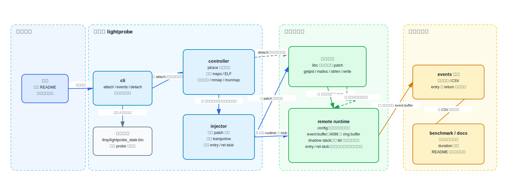

# lightprobe

`lightprobe` 是一个 Linux/x86_64 用户态动态探针原型，面向 2026 年全国大学生计算机系统能力大赛 OS 功能挑战赛道赛题：

```text
轻量级用户态动态探针 / Lightweight Dynamic probe for User Space
```

队伍名：原神启动

## 项目概览

`lightprobe` 不依赖 kernel uprobe trap，而是通过 `ptrace` 控制目标进程，在目标进程内写入一小段 probe runtime，并 patch 动态库函数入口，使函数调用先进入用户态 entry/return stub。当前主线聚焦：

```text
x86_64 + 动态库函数 + entry probe + return probe + event buffer + CLI 管理
```

## 框架图



当前已经完成并验证：

- 动态库函数 attach/detach。
- entry event：采集前 6 个参数、`pid/tid`、时间戳。
- return event：采集返回值和 `duration_ns`。
- `enable/disable/events/list` CLI 管理。
- 单线程和多线程 `getpid/malloc --ret` 闭环。
- 扩展验证 `strlen/write --ret`。
- 基于 `events --csv` 的压力测试和 benchmark 摘要。

## 快速开始

构建主程序：

```bash
make
```

运行单元测试：

```bash
make test
```

构建端到端验证目标：

```bash
make targets
```

运行推荐 smoke 验证：

```bash
./tests/scripts/run_getpid_probe_smoke.sh
./tests/scripts/run_malloc_probe_smoke.sh
./tests/scripts/run_multithread_getpid_probe_smoke.sh
./tests/scripts/run_multithread_malloc_probe_smoke.sh
./tests/scripts/run_strlen_probe_smoke.sh
./tests/scripts/run_write_probe_smoke.sh
```

如果当前终端不能交互输入 sudo 密码，可以用环境变量传入：

```bash
LIGHTPROBE_SUDO_PASSWORD='<password>' ./tests/scripts/run_getpid_probe_smoke.sh
```

注意：当前 CLI 使用 `/tmp/lightprobe_state.bin` 作为全局本地状态文件，端到端脚本应串行执行，避免多个脚本同时清理或覆盖同一份 probe 状态。

## 最小手动 demo

```bash
make clean
make
make targets

./build/tests/target_getpid_loop &
target_pid=$!

sudo ./build/lightprobe attach --pid "$target_pid" --lib libc.so.6 --func getpid --ret
sudo ./build/lightprobe events --pid "$target_pid" --func getpid --limit 8
sudo ./build/lightprobe detach --pid "$target_pid" --func getpid
./build/lightprobe list

kill "$target_pid"
```

典型输出会包含：

```text
attached probe_id=0 pid=<pid> libc.so.6:getpid target=0x... ret=1
type=entry  ... tid=<tid> args=[...]
type=return ... tid=<tid> retval=0x<pid> duration=<ns>
detached pid=<pid> func=getpid
ID  PID      ENABLED  RET  TARGET              LIB:FUNC
```

其中 `retval=0x<pid>` 对应目标进程 PID，说明 return probe 捕获到 `getpid()` 的真实返回值；最后 `list` 只剩表头，说明本地 probe 状态已经清理。

## CLI

```text
attach
detach
enable
disable
events
list
```

### attach

```bash
sudo ./build/lightprobe attach --pid <pid> --lib <lib_name> --func <func_name> [--addr <addr>] [--ret]
```

- `--pid <pid>`：目标进程 PID。
- `--lib <lib_name>`：动态库名，例如 `libc.so.6`。
- `--func <func_name>`：函数名，例如 `getpid`、`malloc`。
- `--addr <addr>`：可选，直接指定目标函数运行时地址；用于 `strlen` 这类 glibc IFUNC 场景，避免只 patch IFUNC resolver 入口。
- `--ret`：安装 return probe。

### events

```bash
sudo ./build/lightprobe events --pid <pid> [--func <func_name>] [--limit <n>] [--csv]
```

CSV 字段：

```text
timestamp_ns,pid,tid,probe_id,event_type,arg1,arg2,arg3,arg4,arg5,arg6,retval,duration_ns
```

### detach

```bash
sudo ./build/lightprobe detach --pid <pid> --func <func_name>
```

detach 会恢复目标函数入口原始指令，尝试释放远程 runtime，并从本地状态表删除 probe。

## 验证矩阵

| 验证项 | 状态 | 说明 |
| --- | --- | --- |
| `make test` | 通过 | 指令长度解析与 stub builder 单元测试 |
| 单线程 `getpid --ret` | 通过 | `retval == target_pid` |
| 单线程 `malloc --ret` | 通过 | `retval` 为有效堆地址 |
| 多线程 `getpid --ret` | 通过 | 多个 `tid` 的 entry/return 成对出现 |
| 多线程 `malloc --ret` | 通过 | 多个 `tid` 的 entry/return 成对出现 |
| 单线程 `strlen --ret` | 通过 | 通过 `--addr` 命中 IFUNC 真实实现，返回字符串长度 |
| 单线程 `write --ret` | 通过 | 捕获 fd/buf/count 参数和写入长度返回值 |
| stress benchmark | 通过 | 输出事件数、entry/return 数、tid 数和 duration 摘要 |

Benchmark 示例：

```bash
./tests/scripts/run_benchmark_summary.sh strlen 8 8 100000
./tests/scripts/run_benchmark_summary.sh malloc 8 8 100000
```

输出示例：

```text
benchmark func=strlen duration=4s events=4096 entry=2048 return=2048 tids=5 return_avg_ns=1534 return_min_ns=1014 return_max_ns=109315
benchmark func=malloc duration=3s events=4096 entry=2048 return=2048 tids=5 return_avg_ns=1598 return_min_ns=1193 return_max_ns=31503
```

## 目录结构

```text
lightprobe/
├── cli/                 # 命令行入口：attach/detach/events/list 等
├── controller/          # ptrace、线程控制、符号解析、远程内存和远程 syscall
├── injector/            # 入口 patch、trampoline、entry/ret stub、probe 生命周期
├── runtime/             # 远程 runtime 数据布局、event buffer、shadow stack
├── include/             # 公共接口和结构体
├── tests/
│   ├── unit/            # 单元测试
│   ├── targets/         # 端到端验证目标程序
│   └── scripts/         # smoke、stress、benchmark 脚本
└── docs/
    ├── competition/       # 官方赛题信息、元数据和评分原件收录目录
    ├── member_a_runtime_layout.md
    ├── member_b_task.md
    ├── verification_and_benchmark.md
    ├── project_structure.md
    └── figures/
```

## 实现边界

- 当前支持 Linux/x86_64 用户态动态库函数。
- hook 安装、远程读写和远程 syscall 依赖 `ptrace`，调试非子进程通常需要 `sudo` 或合适的 ptrace 权限。
- return probe 已支持多线程基础场景，但不是完整工业级 unwinder。
- shadow stack 使用固定线程槽和固定嵌套深度，极高并发、极深递归需要继续扩展。
- 当前对信号中断、线程异步退出、异常控制流等复杂场景只做基础 fallback。
- 当前远程 runtime 使用 RWX 映射，后续可以拆分为 RW 数据区和 RX 代码区。

## 文档导航

- `docs/competition/README.md`：官方赛道信息、赛题编号、截止日期及评分原件获取状态。
- `docs/project_structure.md`：项目目录和模块职责。
- `docs/member_a_runtime_layout.md`：成员 A 的 runtime、entry/return probe 设计。
- `docs/verification_and_benchmark.md`：验证矩阵、脚本用法、benchmark 输出。
- `docs/member_b_task.md`：成员 B controller 任务说明。
- `docs/figures/lightprobe_architecture_cn.svg`：中文框架图，可直接插入 README、报告或 PPT。
- `docs/figures/lightprobe_architecture_cn.drawio`：可用 draw.io 继续编辑的源文件。
